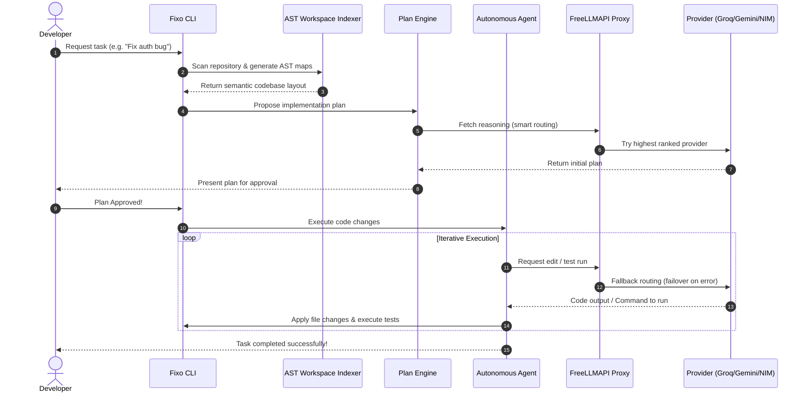

# ⚡ Fixo CLI
> **Autonomous, Free, Multi-Provider LLM Coding Agent CLI**

[](https://www.typescriptlang.org/)
[](https://opensource.org/licenses/Apache-2.0)
[](https://tree-sitter.github.io/tree-sitter/)
[]()

Fixo CLI is a terminal-based autonomous coding assistant designed to execute complex programming tasks directly in your workspace. Built as a self-correcting agent, it analyzes code using abstract syntax trees (AST), writes implementation plans, edits code files, runs test suites, and iterates until the goal is fully achieved.

Fixo CLI integrates seamlessly with **FreeLLMAPI**, automatically load-balancing and failing over across **20+ free LLM providers** (such as Gemini, Groq, SambaNova, Cerebras, and NVIDIA NIM) for zero-cost, state-of-the-art agentic coding.

---

## 📊 Fixo CLI vs. Other Market Leaders

Here is how Fixo CLI compares against other prominent terminal and editor-based coding agents:

| Feature / Metric | **Fixo CLI** | **Claude Code** | **Aider** | **Cline** |
| :--- | :--- | :--- | :--- | :--- |
| **API Cost** | 💰 **100% Free** (via FreeLLMAPI) | 💸 **Paid** (Anthropic API charges) | 💸 **Paid** (Requires personal keys) | 💸 **Paid** (Requires personal keys) |
| **Multi-Provider Fallback**| 🔄 **Automatic Failover** (No interruptions) | ❌ None (Locked to Anthropic) | ❌ Manual (Requires editing configs) | ❌ Manual (Drops request on 429) |
| **Workspace Indexing** | 🌳 **AST / Tree-Sitter** (Semantic map) | 🔍 Regex / basic grep | 🗺️ Git/ctags-based map | 🔍 Basic file search |
| **Autonomy Loops** | 🤖 **Multi-agent / Planning Mode** | 🤖 Agent loops | 💬 Interactive / chat-driven | 💬 Prompt-to-action loops |
| **Self-Correction** | 🧪 **Built-in test runner & loops** | ❌ Manual trigger | ❌ Requires manual input | ❌ Requires manual input |
| **No-Card Verification** | ✅ **Yes** (Zero billing required) | ❌ No (Requires credit card) | ❌ No (Requires paid API keys) | ❌ No (Requires paid API keys) |

---

## ⚙️ Architecture & Lifecycle Flow

Fixo CLI separates concerns between code understanding (AST parser), task coordination (Planner), and execution (Agent). 



---

## 🌟 Key Features

* **Autonomous Agent Loop:** Fixo CLI runs an agent loop that defines planning sub-agents, writes files, runs shell commands, reads compiler output, and self-corrects until tests pass.
* **Workspace AST Indexer:** Uses **Tree-Sitter** to parse JavaScript, TypeScript, Python, and Go codebases, generating a semantic repository map for precise context insertion.
* **Free Multi-Provider Routing:** Connects to your FreeLLMAPI server to query models like Llama 3.3, Qwen 3, and Gemini 2.5/3.1 without incurring high API costs.
* **Smart Cooldown & Failover:** The CLI automatically tracks rate-limited providers (429/402/404) and switches to working alternatives in the fallback chain mid-request.
* **Resilience Stack:** Stream recovery, provider cooldown, context-budget enforcement, and a local telemetry sink work together so the agent stays productive on flaky networks and large codebases. See [Resilience](#-resilience) below.
* **Built-in Workspace Guard:** Safely manages workspace locks, preventing concurrent file writes and ensuring git safety.

---

## 🛡 Resilience

Fixo CLI is built for hostile environments: free-tier rate limits, dropped SSE streams, providers that 502 mid-response, and codebases larger than any single context window. The resilience stack is organised into four independent pillars, each of which can be tuned or disabled individually via `~/.fixocli/config.json`.

| Pillar | Module | What it does | Default |
| :--- | :--- | :--- | :--- |
| **Stream Recovery** | `src/agent/stream-glue.ts` | Detects mid-stream SSE cuts *after* at least one chunk has been yielded, rebuilds the message list with the partial response, and re-issues the request transparently. | `auto` (up to 3 attempts) |
| **Provider Cooldown** | `src/agent/provider-cooldown.ts` | Tracks per-provider success/failure rates. On 429/5xx, applies an exponential cooldown (30/60/120/240/300s for rate limits, 10/20/40/80/120s for server errors) and steers subsequent requests to healthier providers. | always on |
| **Context Budgeting** | `src/agent/context-budget.ts` | Counts real BPE tokens (via `gpt-tokenizer`, cl100k / o200k) before every LLM call. When the next request would overflow, runs a tiered trim (prune tool outputs → drop oldest turn-pairs → truncate tool args) and, if still over, marks the conversation for LLM-based compaction. | `auto` at 80% of model window |
| **Telemetry** | `src/agent/telemetry.ts` | Append-only NDJSON sink at `~/.fixocli/telemetry.jsonl` (rotated at 1 MiB). Emits structured events for retries, cooldowns, stream resumes, context compactions, tool failures, and provider errors. `diagnoseFailures()` reads the recent window and surfaces remediation hints. | `local: on, remote: off` |

### ResilienceConfig schema

All four pillars are controlled by the `preferences.resilience` block in your config. Every field has a safe default, so you can omit the entire block if you want the shipped behaviour.

```jsonc
{
  "preferences": {
    "telemetry": true,            // Master switch for *all* telemetry
    "telemetryLocal": true,       // Append events to ~/.fixocli/telemetry.jsonl
    "telemetryRemote": false,     // POST events to the FreeLLMAPI server (anonymous)
    "resilience": {
      "streamResume":       "auto",    // "auto" | "never"  (kill-switch for stream recovery)
      "maxResumeAttempts":  3,         // additional attempts after a mid-stream cut
      "useWithRetry":       true,      // use the withRetry engine for non-streaming calls
      "contextBudget":      "auto",    // "auto" | "truncate" | "never"  (kill-switch for budget enforcement)
      "contextBudgetRatio": 0.8        // fraction of model window used as the hard cap
    }
  }
}
```

| Field | Type | Default | Behaviour |
| :--- | :--- | :--- | :--- |
| `streamResume` | `"auto" \| "never"` | `"auto"` | When `never`, `chatStream` is called directly and cuts bubble up to the caller as `StreamResumeExhaustedError`. |
| `maxResumeAttempts` | `number` | `3` | How many additional attempts the resume engine makes after a mid-stream cut. 0 disables resume. |
| `useWithRetry` | `boolean` | `true` | Toggle the exponential-backoff `withRetry` engine for non-streaming calls. |
| `contextBudget` | `"auto" \| "truncate" \| "never"` | `"auto"` | `auto` = enforce + LLM-compact; `truncate` = enforce only (no LLM fallback); `never` = skip the enforcer entirely. |
| `contextBudgetRatio` | `number` (0–1) | `0.8` | Fraction of the model's input window used as the hard cap. 0.8 leaves 20% headroom for the response. |
| `telemetryLocal` | `boolean` | `true` | Disable to skip the local NDJSON sink while keeping the remote one (if enabled). |
| `telemetryRemote` | `boolean` | `false` | Opt in to the legacy HTTP poster for anonymous usage stats. |

### Diagnosing a bad session

After a session that didn't go well, run the diagnostic from the CLI:

```bash
fixo --diagnose
```

Or read the log directly:

```bash
tail -50 ~/.fixocli/telemetry.jsonl | jq .
```

`diagnoseFailures()` looks at the last hour by default and reports patterns such as:
- 3+ retries in the window → likely flaky network or rate-limit
- provider cooldown → at least one provider is rate-limiting; others are being preferred automatically
- stream-resume exhaustion → raise `maxResumeAttempts` or check your network
- repeated tool failures → the same tool has failed 3+ times; check its inputs
- 5+ provider errors → likely a provider outage

See [`docs/RESILIENCE.md`](docs/RESILIENCE.md) for the pillar-by-pillar design notes.

---

## 🛡 Operational Resilience & Enterprise Hardening

The Resilience section above covers **uptime** (how Fixo stays
alive through network noise). This section covers **integrity**
— how Fixo protects the user's workspace and secrets. The two
are deliberately orthogonal and live in separate configuration
blocks:

| Concern | Configuration block | Purpose |
|---|---|---|
| **Resilience** | `preferences.resilience` | Stream resume, context budgeting, retry engine. |
| **Safety** | `preferences.safety` | Loop detection, atomic file writes, LSP pre-save, credential vault. |

### Safety configuration schema

The full schema lives under `preferences.safety` in
`~/.fixocli/config.json`. Defaults are safe for interactive
use; tighten them for CI / unattended runs.

```json
{
  "preferences": {
    "safety": {
      "atomicStaging":     true,
      "stagingTtlMs":      86400000,
      "lspPreSave":        "warn",
      "loopTrap": {
        "triggerCount":        3,
        "hardAbortCount":      6,
        "toolResultTailBytes": 1024,
        "maxHistory":          64,
        "enabled":             true
      }
    }
  }
}
```

| Field | Type | Default | Behaviour |
|---|---|---|---|
| `atomicStaging` | `boolean` | `true` | Route every file write through the shadow-staging pipeline. When `false`, the executor falls back to the legacy direct-write path (faster, but non-atomic). |
| `stagingTtlMs` | `number` (ms) | `86400000` (24h) | Staged writes older than this are eligible for auto-GC. |
| `lspPreSave` | `"off" \| "warn" \| "block"` | `"warn"` | `off` = no-op; `warn` = log diagnostics, allow commit; `block` = throw on any `error`-severity diagnostic and roll back. |
| `loopTrap.triggerCount` | `number` | `3` | Consecutive equivalent turns that fire the `[Loop-Trap]` directive. |
| `loopTrap.hardAbortCount` | `number` | `6` | Consecutive equivalent turns that throw `LoopTrapAbortedError`. |
| `loopTrap.toolResultTailBytes` | `number` (bytes) | `1024` | Length of tool-result tail that is hashed. |
| `loopTrap.maxHistory` | `number` | `64` | Cap on in-memory detector history. |
| `loopTrap.enabled` | `boolean` | `true` | Master kill-switch for the detector. |
| `semanticLoopTrap.enabled` | `boolean` | `true` | Master kill-switch for the *semantic* detector (tracks per-file frequency in a sliding window). |
| `semanticLoopTrap.windowSize` | `number` | `5` | Width of the sliding window. |
| `semanticLoopTrap.triggerCount` | `number` | `3` | File accesses inside the window that fire the `[Safety-Alert]` directive. |
| `semanticLoopTrap.hardAbortCount` | `number` | `6` | File accesses inside the window that throw `SemanticLoopAbortedError` (and roll back any staged writes). |
| `largeFileGateBytes` | `number` (bytes) | `15360` (15 KiB) | `read_file` returns a `[Context-Budget Guard]` directive when a file exceeds this size. |
| `largeFileGateLines` | `number` | `350` | Same gate, line-count threshold. |

### Hardening profiles

| Profile | `atomicStaging` | `lspPreSave` | `loopTrap` |
|---|---|---|---|
| **Interactive dev** *(default)* | `true` | `"warn"` | `3 / 6` |
| **CI / unattended** | `true` | `"block"` | `2 / 4` |
| **Trusted fine-tune** | `false` | `"off"` | `5 / 10` |
| **Benchmarking** | `false` | `"off"` | kill-switch |

### The four safety pillars

| # | Pillar | What it stops | Where it lives |
|---|---|---|---|
| 1 | **Deterministic Loop-Trap Defenses** (composite + semantic) | An LLM that re-issues equivalent tool calls *or* hammers the same file with varied arguments. | `src/runtime/loop-trap.ts` |
| 2 | **Atomic Workspace Shadow Staging** | A process kill mid-write leaving the user's file truncated. | `src/runtime/staging.ts` |
| 3 | **Live Pre-Save LSP Compilation Check** + **Context-Budget Guard** | An LLM writing syntactically valid but semantically broken code, *or* flooding the context window with a single 200KB file. | `src/lsp/lsp-pre-save.ts` + `src/lsp/syntax-fallback.ts` + the large-file gate in `src/agent/tool-executor.ts` |
| 4 | **Restricted Credential Sandboxing & Redaction** | Direct-provider API keys leaking into a tool result, log line, or model prompt. | `src/runtime/credential-vault.ts` + `src/runtime/redaction.ts` |

#### Pillar 1 — Composite *and* semantic loop detection

Two detectors run in parallel:

- **Composite** (`LoopTrapDetector`) — fingerprints the tool call
  *arguments* and the tail of the tool *result* and trips when
  three consecutive turns hash to the same value. Defends
  against a deterministic "stare at one line" loop.
- **Semantic** (`SemanticLoopDetector`) — fingerprints the
  *target file path* of every file-mutating tool and trips when
  the same path appears three times inside a sliding 5-turn
  window. Defends against an LLM that varies its search
  arguments (different line numbers, different patterns) but
  keeps hammering the same file.

On `triggerCount` the detector injects a `[Safety-Alert]`
directive into the next system prompt. On `hardAbortCount` it
throws `SemanticLoopAbortedError`, which the agent catches and
translates into a clean `AtomicStagingManager.rollbackAll()` so
no half-edited file survives.

#### Pillar 3 — Context-Budget Guard

`read_file` is gated by both a byte threshold (`largeFileGateBytes`,
default 15 KiB) and a line threshold (`largeFileGateLines`,
default 350). When a file exceeds either, the LLM receives a
synthetic `[Context-Budget Guard]` directive that points it at
the new structural pre-scan tools:

- `extract_symbols(path)` — top-level declarations only (cap
  100 per file).
- `extract_imports(path)` — dependency list only (cap 100 per
  file).

Each pre-scan call records the result in the
`TaskSession.structuralMaps` map so the LLM's later reads can
prove they were narrowed first.

#### Pillar 3 — LSP syntax fallback

When no language server (`typescript-language-server`,
`gopls`, `rust-analyzer`, …) is on the `PATH`, the pre-save
gate falls back to `syntaxHealthCheck` — a pure-JS
brace/paren/bracket balance check that runs in microseconds.
Set `FIXO_LSP_FALLBACK=syntax-only` to force the fallback even
when a real LSP is available (useful for sandboxed CI). The
boot sequence also surfaces a one-time warning when neither is
present.

#### Pillar 4 — Three redaction modes

`src/runtime/redaction.ts` exposes three helpers for the three
distinct places redaction is needed:

- `stripAnsi(value)` — drop every ANSI escape entirely. Use
  for content piped into another tool that doesn't care about
  colour.
- `redactAnsi(value)` — replace the `\x1b` byte with the
  printable form `\\x1b` so the message survives a log write /
  telemetry upload without injecting control codes downstream.
  Use for content whose *bytes* must be preserved (file paths,
  error messages).
- `scrubForLlm(value)` — strip ANSI *and* replace every
  recognised secret pattern with `[REDACTED]`. This is the
  only safe redaction for content heading back into a model
  prompt.

### Automated background garbage collection

The staging pipeline writes to `<cwd>/.fixo/staging/<runId>/`
and would silently bloat the disk if entries were never
cleaned up. Two sweeps run automatically:

- **Per-run GC** — `AtomicStagingManager.gc()` removes entries
  older than `stagingTtlMs` from the current run's directory.
- **Global GC** — `AtomicStagingManager.garbageCollectAll(cwd, ttlMs)`
  sweeps every `<runId>/` directory. Invoked at the start of
  every `runStreaming` lifecycle (typically < 2 ms) and also
  exposed via the `/fixo gc` slash command for power users.

GC is bounded and uses the metadata `createdAt` timestamp
rather than file mtime, so the TTL is a deterministic policy
decision rather than a side effect of kernel flush timing.

### Troubleshooting runbooks

#### "The agent is stuck in a loop"

The `[Loop-Trap]` directive is injected into the system prompt
after 3 consecutive equivalent turns. The model is expected to
reconsider its strategy. If it doesn't, the detector hard-
aborts at 6 turns and the session terminates with
`LoopTrapAbortedError`.

**Diagnosis:**
```bash
tail -100 ~/.fixocli/telemetry.jsonl | jq 'select(.event == "loopTrap")'
```

**Fix:**
1. Read the directive — it tells the LLM *why* the loop is
   happening. Common causes:
   - The test command is failing consistently → fix the test.
   - The patch is being reverted by a pre-commit hook → fix the hook.
   - The agent is confused about file paths → clarify the task.
2. Force a manual compaction to drop the noise from the
   conversation history:
   ```bash
   fixo --compact
   ```
3. To disable the detector for a single session (debugging
   only), set `loopTrap.enabled` to `false` in
   `~/.fixocli/config.json`.

#### "LSP gate blocked my write"

`write_file` returns
`Error: Pre-commit hook rejected: LSP pre-save blocked: N
error(s) in <path> — <line>:<col> <message>; ...`

**Diagnosis:**
1. The first 3 error messages in the string are the gate's
   best guess at the root cause.
2. Open the file in your editor — the LSP (if installed)
   underlines the offending line.
3. Common causes:
   - Missing import → add it.
   - Type mismatch → fix the annotation.
   - Reference to an undeclared identifier → typo.

**The original file is preserved on every blocked write.**
Re-run the agent's suggested fix and try again.

**If the gate is over-firing** (a known-good write is being
rejected), lower the mode from `block` to `warn`:
```json
{ "preferences": { "safety": { "lspPreSave": "warn" } } }
```

#### "A write silently rolled back"

The agent said it wrote a file, but the file is unchanged.

**Diagnosis:**
1. Check the tool result string for
   `PreCommitHookRejectedError` or `StagingPathEscapeError`.
2. For `PreCommitHookRejectedError`, the `cause` field is the
   underlying error (`LspPreSaveBlockedError`, or a future
   pre-commit hook). Read `cause.message`.
3. For `StagingPathEscapeError`, the target path escapes the
   workspace root — this is a caller bug. Reject and re-prompt.

#### "Staging directory is filling my disk"

```bash
du -sh ~/.fixo/staging
```

**Fix:**
1. The auto-GC runs at the start of every `runStreaming` cycle.
   If the directory is large *during* a session, an LLM is
   staging writes but failing to commit them. Inspect the
   session log for `PreCommitHookRejectedError`.
2. Manual sweep (safe; staging is ephemeral):
   ```bash
   rm -rf ~/.fixo/staging/*
   ```
3. Lower `stagingTtlMs` to expire entries sooner:
   ```json
   { "preferences": { "safety": { "stagingTtlMs": 3600000 } } }
   ```

#### "A direct-provider API key was rejected"

```bash
fixo providers list
fixo providers add openai sk-proj-...
```

The vault is auto-hydrated on the next `getDirectConfig` call,
so the new key is visible immediately — no restart required.

> **Security note:** never paste a real key into a chat
> message, a GitHub issue, or a tool result. `scrubForLlm`
> redacts common shapes, but a low-entropy prefix is not
> guaranteed to match.

#### "I need to fully reset the safety layer"

```bash
# Drop the staging directory (ephemeral)
rm -rf ~/.fixo/staging

# Drop the cached vault singleton (next call re-hydrates)
fixo providers reset-vault

# Reset to safe production defaults
fixo config reset --section safety
```

See [`docs/SAFETY.md`](docs/SAFETY.md) for the full threat
model, design notes, and operator reference.

---

## 🖥️ Dashboard

The `Dashboard` (`src/ui/render.ts`) is a typed event bus that
the agent and any number of subscribers (UI, telemetry, tests)
can wire into without coupling:

- `Dashboard` is a pure state holder. It never touches stdout.
- `DashboardSubscriber` is a one-method interface; errors
  thrown by a subscriber are counted in
  `Dashboard.subscriberErrors` and never propagate.
- The default `AnsiRenderer` paints a double-buffered surface
  to the terminal and chooses one of three render modes:
  - `off` — non-TTY (CI, captured pipes). Nothing is written.
  - `single-line` — terminals below 80×24.
  - `dashboard` — full multi-line surface.

Wiring an additional subscriber is one line:

```ts
import { dashboard, AnsiRenderer } from './ui/render.js';
const renderer = new AnsiRenderer();
dashboard.subscribe(renderer);
```

The agent emits `turn-start`, `tool-start`, `tool-finish`,
`tokens`, `status`, `log`, `mode`, and `done` events. Each
event is a tagged union so refactors stay type-safe.

---

## 🚀 Getting Started

### 1. Prerequisites
Ensure you have **Node.js (v18+)** and **npm** installed. Fixo CLI connects to FreeLLMAPI, so you should have a running FreeLLMAPI server or access to a unified proxy endpoint.

### 2. Installation
Clone the repository and install dependencies:
```bash
git clone https://github.com/Abrar-Akhunji/FIXO_CLI.git
cd FIXO_CLI
npm install
```

### 3. Build the CLI
Compile the TypeScript code:
```bash
npm run build
```

### 4. Configuration
Create a `.env` file at the root of your project:
```env
# URL of your FreeLLMAPI instance
FREELLMAPI_URL=http://localhost:3001
# Your unified API key (retrieve from FreeLLMAPI Dashboard)
FREELLMAPI_KEY=your-unified-api-key-here
```

### 5. Run the CLI
Start Fixo CLI in dev mode or link it globally:
```bash
# Run directly
npm run dev

# Or link globally to run 'fixo' from anywhere
npm link
fixo
```

---

## 📄 License
This project is licensed under the Apache License 2.0 - see the [LICENSE](LICENSE) file for details.
