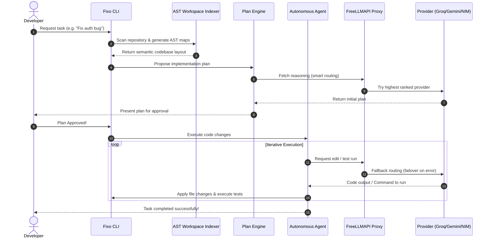

# ⚡ Fixo CLI
> **Autonomous, Free, Multi-Provider LLM Coding Agent CLI**

[](https://www.typescriptlang.org/)
[](https://opensource.org/licenses/Apache-2.0)
[](https://tree-sitter.github.io/tree-sitter/)
[]()

Fixo CLI is a terminal-based autonomous coding assistant designed to execute complex programming tasks directly in your workspace. Built as a self-correcting agent, it analyzes code using abstract syntax trees (AST), writes implementation plans, edits code files, runs test suites, and iterates until the goal is fully achieved.

Fixo CLI integrates seamlessly with **FreeLLMAPI**, automatically load-balancing and failing over across **20+ free LLM providers** (such as Gemini, Groq, SambaNova, Cerebras, and NVIDIA NIM) for zero-cost, state-of-the-art agentic coding.

---

## 📊 Fixo CLI vs. Other Market Leaders

Here is how Fixo CLI compares against other prominent terminal and editor-based coding agents:

| Feature / Metric | **Fixo CLI** | **Claude Code** | **Aider** | **Cline** |
| :--- | :--- | :--- | :--- | :--- |
| **API Cost** | 💰 **100% Free** (via FreeLLMAPI) | 💸 **Paid** (Anthropic API charges) | 💸 **Paid** (Requires personal keys) | 💸 **Paid** (Requires personal keys) |
| **Multi-Provider Fallback**| 🔄 **Automatic Failover** (No interruptions) | ❌ None (Locked to Anthropic) | ❌ Manual (Requires editing configs) | ❌ Manual (Drops request on 429) |
| **Workspace Indexing** | 🌳 **AST / Tree-Sitter** (Semantic map) | 🔍 Regex / basic grep | 🗺️ Git/ctags-based map | 🔍 Basic file search |
| **Autonomy Loops** | 🤖 **Multi-agent / Planning Mode** | 🤖 Agent loops | 💬 Interactive / chat-driven | 💬 Prompt-to-action loops |
| **Self-Correction** | 🧪 **Built-in test runner & loops** | ❌ Manual trigger | ❌ Requires manual input | ❌ Requires manual input |
| **No-Card Verification** | ✅ **Yes** (Zero billing required) | ❌ No (Requires credit card) | ❌ No (Requires paid API keys) | ❌ No (Requires paid API keys) |

---

## ⚙️ Architecture & Lifecycle Flow

Fixo CLI separates concerns between code understanding (AST parser), task coordination (Planner), and execution (Agent). 



---

## 🌟 Key Features

* **Autonomous Agent Loop:** Fixo CLI runs an agent loop that defines planning sub-agents, writes files, runs shell commands, reads compiler output, and self-corrects until tests pass.
* **Workspace AST Indexer:** Uses **Tree-Sitter** to parse JavaScript, TypeScript, Python, and Go codebases, generating a semantic repository map for precise context insertion.
* **Free Multi-Provider Routing:** Connects to your FreeLLMAPI server to query models like Llama 3.3, Qwen 3, and Gemini 2.5/3.1 without incurring high API costs.
* **Smart Cooldown & Failover:** The CLI automatically tracks rate-limited providers (429/402/404) and switches to working alternatives in the fallback chain mid-request.
* **Built-in Workspace Guard:** Safely manages workspace locks, preventing concurrent file writes and ensuring git safety.

---

## 🚀 Getting Started

### 1. Prerequisites
Ensure you have **Node.js (v18+)** and **npm** installed. Fixo CLI connects to FreeLLMAPI, so you should have a running FreeLLMAPI server or access to a unified proxy endpoint.

### 2. Installation
Clone the repository and install dependencies:
```bash
git clone https://github.com/Abrar-Akhunji/FIXO_CLI.git
cd FIXO_CLI
npm install
```

### 3. Build the CLI
Compile the TypeScript code:
```bash
npm run build
```

### 4. Configuration
Create a `.env` file at the root of your project:
```env
# URL of your FreeLLMAPI instance
FREELLMAPI_URL=http://localhost:3001
# Your unified API key (retrieve from FreeLLMAPI Dashboard)
FREELLMAPI_KEY=your-unified-api-key-here
```

### 5. Run the CLI
Start Fixo CLI in dev mode or link it globally:
```bash
# Run directly
npm run dev

# Or link globally to run 'fixo' from anywhere
npm link
fixo
```

---

## 📄 License
This project is licensed under the Apache License 2.0 - see the [LICENSE](LICENSE) file for details.
