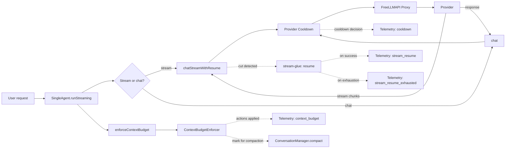

# Resilience Architecture

> Pillar-by-pillar design notes for the FixO CLI resilience stack.
> See [README § Resilience](../README.md#-resilience) for the user-facing overview and config schema.

The FixO CLI is built for hostile environments. The free multi-provider proxy fronts twenty-plus providers, each with its own rate limits, quirks, and outage patterns. Streams get cut when the underlying TCP connection dies. Context windows are smaller than the codebases users want to apply the agent to. Models hallucinate tool calls. The resilience stack is the answer to all of these.

It is organised as **four independent pillars**, each of which can be tuned or disabled individually through `preferences.resilience` in `~/.fixocli/config.json`. The pillars are deliberately orthogonal: stream recovery does not depend on context budgeting, telemetry does not depend on cooldown, and so on. A failure in one pillar does not cascade into the others.

---

## Pillar 1 — Stream Recovery

**Module:** `src/agent/stream-glue.ts` (and the `chatStreamWithResume` method on `AgentClient`)

### The problem

Server-sent events are half-duplex. The producer (provider) keeps the TCP socket open and pushes tokens as they are produced. The consumer (the agent loop) reads them. Either side can drop the connection at any moment:

- The provider rate-limits mid-response and closes the socket.
- The proxy returns a 502 partway through (upstream provider died).
- The user's Wi-Fi hiccups for 800 ms.
- The FreeLLMAPI server crashes and restarts.

When the socket dies, the consumer has already received *some* of the response. The first chunk is good, the last chunk received is good, and everything in between is good — the response is just incomplete. If the agent re-issues the request, it pays for the entire prompt again and gets a *different* (likely non-overlapping) response, breaking continuity on the user's screen.

### The solution

`chatStreamWithResume(messages, model, options, maxResumeAttempts)` wraps the existing `chatStream` in a state machine:

1. Drain the inner stream, yielding every chunk to the consumer.
2. If the inner stream throws *after* at least one chunk has been yielded, the cut is *mid-stream*.
3. Reconstruct the partial response by concatenating `content` and `thinking` chunks in arrival order. Tool-call metadata is recorded but not yielded as text.
4. Push the partial response as a synthetic `assistant` message and a `[STREAM RESUMED]` user message into the working message list.
5. Re-issue the request and continue yielding from the new attempt.
6. If the cut happens inside a `tool_call_start` or `tool_call_delta` chunk, the tool call is atomic and cannot be resumed — surface `StreamResumeExhaustedError` with `cutDuringToolCall: true` and let the agent decide whether to retry the whole turn.
7. If the resume attempt budget is exhausted (default 3), throw `StreamResumeExhaustedError` with the preserved partial.

The consumer is unaware that a resume happened. It sees a single `AsyncGenerator<StreamChunk>`.

### The kill-switch

`preferences.resilience.streamResume = "never"` short-circuits the wrapper and calls `chatStream` directly. Cuts bubble up as `StreamResumeExhaustedError` and the caller is responsible for handling them. This is the escape hatch for users who want exact 1:1 historical behaviour, or who are debugging the resume engine itself.

### Race-condition review

The resume engine is sensitive to three races:
- *Chunk arrival during reconstruction.* We collect chunks synchronously in the `attemptChunks` array. The inner `chatStream` is an async iterator, so chunks arrive one at a time. Reconstruction happens *after* the iterator has either completed or thrown, never during.
- *Re-entrancy.* The resume engine holds its own state in locals (`workingMessages`, `resumeAttempt`, `attemptChunks`). A new attempt always starts with a fresh `attemptChunks = []`. There is no shared mutable state between attempts.
- *Backpressure.* We yield every chunk as it arrives, so the consumer controls the rate. If the consumer is slow, the producer is slow — the SSE protocol handles this naturally.

### Tests

- 15 unit tests in `src/__tests__/stream-glue.test.ts` covering `reconstructPartialResponse`, `isMidStreamResumable`, error classes.
- 16 unit tests in `src/__tests__/retry.test.ts` covering `withRetry`, `parseRetryAfter`, `computeBackoffMs`, `abortableSleep`.
- 5 integration tests in `src/__tests__/integration-stream-recovery.test.ts` covering resume across mid-stream cuts, exhaustion, tool-call cuts, and pre-stream errors.

---

## Pillar 2 — Provider Cooldown

**Module:** `src/agent/provider-cooldown.ts`

### The problem

Free-tier providers rate-limit aggressively. The FreeLLMAPI proxy fronts 20+ providers, but it does not know in advance which one is healthy. A 429 from one provider today does not predict a 429 from the same provider tomorrow, but it does predict a high probability of a 429 *for the next 5–10 minutes*. Without cooldown tracking, the agent will hammer the same rate-limited provider, get the same 429, and burn through its own retry budget on a request that is guaranteed to fail.

### The solution

`ProviderCooldownManager` is a process-local singleton that tracks per-provider state:

- **Total requests, total failures, total rate-limited.** Used to compute a coarse health signal.
- **Consecutive failures.** Resets on success. Drives the exponential backoff.
- **Last failure timestamp and error message.** Surfaced in `suggestNext` so the user can see *why* a provider is cooling down.
- **Cooldown deadline.** When in cooldown, `assertAvailable` throws `ProviderInCooldownError` with the remaining wait.
- **100-request rolling window of (status, latency) samples.** Used to compute a percentile-based health score for `suggestNext`.

The cooldown schedules are tuned per failure family:

| Family | Trigger | Cooldown schedule (consecutive failures 1–5) | Cap |
| :--- | :--- | :--- | :--- |
| 429 / rate limit | `classifyStatus(429) === '429'` | 30, 60, 120, 240, 300 s | 5 min |
| 5xx / server error | `classifyStatus(5xx) === '5xx'` | 10, 20, 40, 80, 120 s | 2 min |
| 4xx (other) | not retryable | 0 s (resets consecutive counter) | n/a |
| Network (status 0) | `classifyStatus(0) === 'network'` | 10, 20, 40, 80, 120 s | 2 min |

`suggestNext()` ranks providers in iteration order: first-available wins. Ties are broken by smallest remaining cooldown.

### Wiring

`AgentClient.getProviderId(model)` resolves a stable provider id from a model name. Every `chat`, `chatStream`, and `getEmbedding` call goes through a thin `trackProviderError()` helper that wraps `providerCooldown.recordFailure()` and emits a telemetry event. Successful calls call `providerCooldown.recordSuccess()`. The retry loops check `assertAvailable` before issuing the next attempt.

### Tests

16 unit tests in `src/__tests__/provider-cooldown.test.ts` covering the schedule math, the rolling window, the public API, the no-retryable case, and the `suggestNext` tie-breaking.

---

## Pillar 3 — Context Budgeting

**Modules:** `src/agent/tokenizer.ts`, `src/agent/context-budget.ts`, `ConversationManager.enforceBudget()`

### The problem

A coding agent on a long session can easily blow past the model's context window. The original `ConversationManager` used a `text.length / 4` heuristic, which underestimates by 30–40% for code, JSON, and repeated tokens. When the estimate is too low, the user gets a 413 *after* the LLM call has been issued and the cost has been paid.

### The solution

Three layers:

1. **Real BPE counting.** `src/agent/tokenizer.ts` wraps `gpt-tokenizer` with a model-aware encoder router. `cl100k_base` is used for the OpenAI / Llama / Mistral / Gemini / Claude family that the FreeLLMAPI proxy fronts; `o200k_base` is used for `gpt-4o` / `o1` / `o3` / `o4`. The counts are within ~10–20% of the provider's true bill — close enough to prevent overflow, off by enough that we never push the budget to the literal edge.
2. **Tiered enforcement.** `ContextBudgetEnforcer.enforce(messages, { maxTokens, model })` is a pure, side-effect-free state machine. It runs four tiers, returning a `BudgetReport` describing what changed:
   - Tier 1 — prune tool outputs in non-tail messages down to 2,000 chars.
   - Tier 2 — drop the oldest user/assistant turn-pairs, preserving the last `tailMessages` (default 4 = 2 turn-pairs).
   - Tier 3 — truncate the `arguments` JSON of any remaining tool calls to 2,000 chars.
   - Tier 4 — give up; mark the conversation for LLM-based compaction. The caller (the agent loop) should call `ConversationManager.compact()`, which summarises the oldest turns via an LLM call.
3. **Hook into the agent loop.** `SingleAgent.enforceContextBudget()` is called right after the existing `autoCompactIfNeeded()` at all three LLM call sites (trivial-query, complex-task, and pure-chat). The kill-switch `preferences.resilience.contextBudget = "never"` short-circuits to a no-op. The `truncate` policy runs the enforcer but skips the LLM-based compaction fallback.

### Migration path

`ConversationManager.estimateTokens()` used to be a private method using the `text.length / 4` heuristic. It is now a thin wrapper around `countTokens(text, model)` from the tokenizer module. The signature and call-sites did not change, so the 6 existing tests that exercise pruning and compaction continue to pass unchanged.

### Tests

- 10 unit tests in `src/__tests__/tokenizer.test.ts` covering encoder routing, per-message overhead, and the closed union of encoder names.
- 9 unit tests in `src/__tests__/context-budget.test.ts` covering all four enforcement tiers, the mark-for-compaction fallback, history-mutation guarantees, and edge cases.
- 6 integration tests in `src/__tests__/conversation-enforce-budget.test.ts` exercising the `ConversationManager.enforceBudget()` method end-to-end.

---

## Pillar 4 — Telemetry

**Module:** `src/agent/telemetry.ts`

### The problem

When something goes wrong on a long-running agent session, the user has no way to know *what*. The CLI prints error messages, but the messages are local to the failing call. There is no audit trail of retries, cooldown decisions, stream resumes, context compactions, or tool failures over the lifetime of a session. When the user files a bug, the only thing we have is a vague description.

### The solution

A local-first NDJSON sink at `~/.fixocli/telemetry.jsonl`. Every interesting event is appended as a single JSON line:

```json
{"ts":"2026-06-05T18:25:01.000Z","type":"cooldown","sid":"a1b2c3d4e5f6","fields":{"providerId":"groq","status":429,"cooldownMs":30000,"reason":"rate limit"}}
```

- **One event per line.** Easy to `tail`, `grep`, and `jq`.
- **1 MiB rotation** with a single `.1` backup. Disk usage is bounded.
- **Append-only.** The sink never rewrites history, so a crash mid-write is at worst one corrupted line.
- **Per-sink opt-out.** `telemetryLocal: false` disables the local file; `telemetryRemote: true` re-enables the legacy HTTP poster for users who want to contribute anonymous usage stats to the FreeLLMAPI server.
- **Local-only by default.** The `telemetryRemote` flag defaults to `false`. The user's disk is private unless they explicitly opt in.

### Event types

| Type | When | Fields |
| :--- | :--- | :--- |
| `tool_call` | Every tool call (legacy `logTelemetry` payload) | `tool`, `status`, `error?`, `durationMs?` |
| `session_start` | CLI boot | `model`, `cwd` |
| `session_end` | CLI shutdown | `durationMs`, `toolCalls`, `totalTokens` |
| `retry` | Every `withRetry` attempt | `fn`, `attempt`, `delayMs`, `error` |
| `cooldown` | Provider enters cooldown | `providerId`, `status`, `cooldownMs`, `reason` |
| `stream_resume` | Mid-stream cut recovered | `resumeAttempt`, `partialTokens`, `ok: true` |
| `stream_resume_exhausted` | Mid-stream cut *not* recovered | `resumeAttempt`, `partialTokens`, `ok: false`, `reason` |
| `context_budget` | Enforcer ran | `tokensBefore`, `tokensAfter`, `actions[]`, `markedForCompaction` |
| `provider_error` | 4xx/5xx (non-retryable) | `providerId`, `status`, `message` |

### `diagnoseFailures(windowMs)`

Pure function that reads the last `windowMs` of events (default 1 hour) and returns a prioritised list of `DiagnosisHint` objects. Each hint has a one-line summary, a severity, a count, and a remediation suggestion. The rules:

- 3+ retries in the window → "Flaky network or rate-limit" (warn)
- 1+ cooldown event → "Provider X is rate-limited" (warn)
- 1+ stream_resume_exhausted → "Stream cuts not recovering" (error)
- 1+ context_budget with compaction → "Context is filling up" (info)
- 3+ tool_call failures of the same tool → "Tool X keeps failing" (warn)
- 5+ provider_error in window → "Provider outage" (error)

### Tests

14 unit tests in `src/__tests__/telemetry.test.ts` covering append ordering, limit windowing, rotation at 1 MiB, the failure-when-fs-fails path, every diagnose rule, and the window filter (old events are correctly excluded).

---

## How the pillars interact



The four pillars share *one* integration point: the telemetry sink. Every interesting event from every pillar flows through `recordTelemetry()`. There are no other cross-pillar dependencies.

## Why local telemetry, not remote-only?

The original implementation posted events to the FreeLLMAPI server. That works for a hosted service but is wrong for a CLI that runs in the user's terminal:

- The HTTP call adds latency to every error path.
- It fails silently when the server is down, which is the exact moment we most want the data.
- It assumes the user is online, which is not always true.

The local-first design is faster, more reliable, and gives the user full ownership of the data. The remote sink is preserved as an opt-in secondary path for users who want to contribute anonymous usage stats.

## Adding a new pillar

The four pillars are independent. A new pillar (for example, "Tool Sandboxing" or "Cost Budget") would:

1. Live in its own `src/agent/<pillar>.ts` module.
2. Expose a typed event constructor on the `telemetry` object.
3. Add a kill-switch field to `ResilienceConfig` and a deep-merge entry in `loadConfig()`.
4. Be wired into `SingleAgent.runStreaming` (or the appropriate call site).
5. Have its own `__tests__/<pillar>.test.ts` file.
6. Be documented in this file and in the README schema table.

The resilience stack is intentionally a federation, not a monolith.
